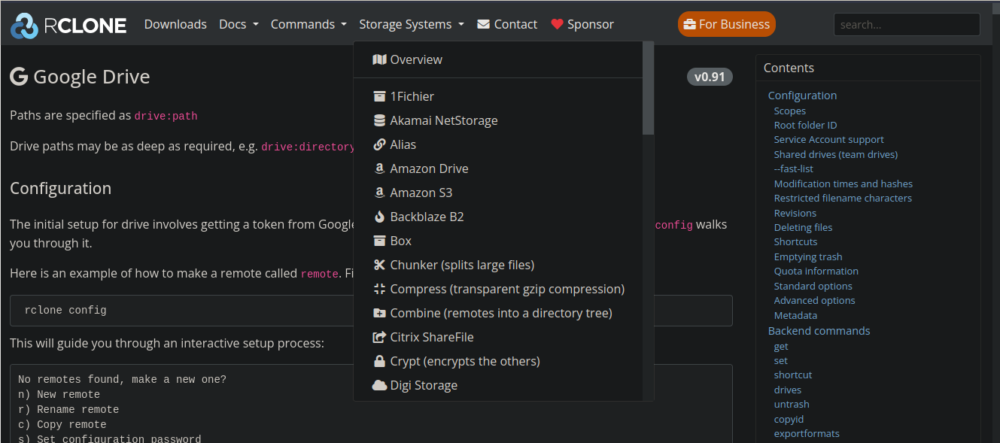

## Sincronzación automatica de KeePass2 con almacenamiento remoto (Google Drive, OneDrive)
Este script realiza la sincronización de una base de datos de [KeePass2](https://keepass.info) con una plataforma de almacenamiento en la nube (Google Drive, OneDrive, etc). Esto como alternativa a los plugins de sincronización que no están disponibles en Linux. 
## Dependencias 
Se requieren las siguientes dependencias: 
- Keepass2 `apt install keepass2` 
- [Rclone](https://rclone.org/) `apt install rclone` 
## Configuración de Rclone 
Para lograr la sincronización es necesario proveer las credenciales de la cuenta a sincronizar (Google Drive, OneDrive, etc) a Rclone, en la documentación oficial está el proceso de configuración para las diferentes plataformas. 


## Configuración del Script 
En el script es necesario configurar las líneas 17, 20, 21 y 22 con la siguiente información: 
- `17` nombre del almacenamiento definido en la configuración de Rclone 
- `20` nombre del archivo de la base de datos de KeePass en la máquina LOCAL (nombre_del_archivo.kdbx) 
- `21` ruta absoluta de la ubicación de la base de datos de KeePass en la máquina LOCAL (sin incluir el archivo, solo los directorios) 
- `22` ruta absoluta de la ubicación de la base de datos en el almacenamiento remoto (sin incluir el archivo, solo los directorios, en caso de estar en la raíz del sistema de almacenamiento, dejar vacío) 
> [!NOTE]
Los nombres de las bases de datos deben coincidir en la máquina local y en el sistema de almacenamiento remoto. 
## Tarea cron (opcional) 
Si deseas que cada vez que se encienda el equipo se sincronice automáticamente las bases de datos, puedes definir una tarea cron de la siguiente manera:

```bash 
crontab -e 
``` 

y en la última línea del archivo escribir 

```bash 
@reboot bash PATH_DE_LA_UBICACION_DEL_ARCHIVO/syncKeepass.sh 
```
## Instalación del Plugin KeePassRPC para el navegador (opcional)
Para instalar este plugin es necesario primerio descargar la siguiente dependencia

- mono-complete `apt install mono-complete`

Posteriormente descargar la última versión del plugin desde el [el sitio oficial de GitHub](https://github.com/kee-org/keepassrpc/releases) (.plgx) y mover el archivo con permisos de administrador a la ruta `/usr/lib/keepass2/Plugins`. 

Finalmente, se debe instalar la extensión para [Chrome](https://chromewebstore.google.com/detail/kee-password-manager/mmhlniccooihdimnnjhamobppdhaolme) o [Firefox](https://addons.mozilla.org/es/firefox/addon/keefox/).

## Otros Plugins (opcional)
- [KeeTheme](https://github.com/xatupal/KeeTheme) (Windows - Linux)
- [KPSync for Google Drive](https://github.com/walterpg/google-drive-sync/) (Windows)
- [Yet Another Favicon Downloader](https://github.com/navossoc/KeePass-Yet-Another-Favicon-Downloader) (Windows - Linux)
- [Traducción al español](https://keepass.info/translations.html) (Windows - Linux)
